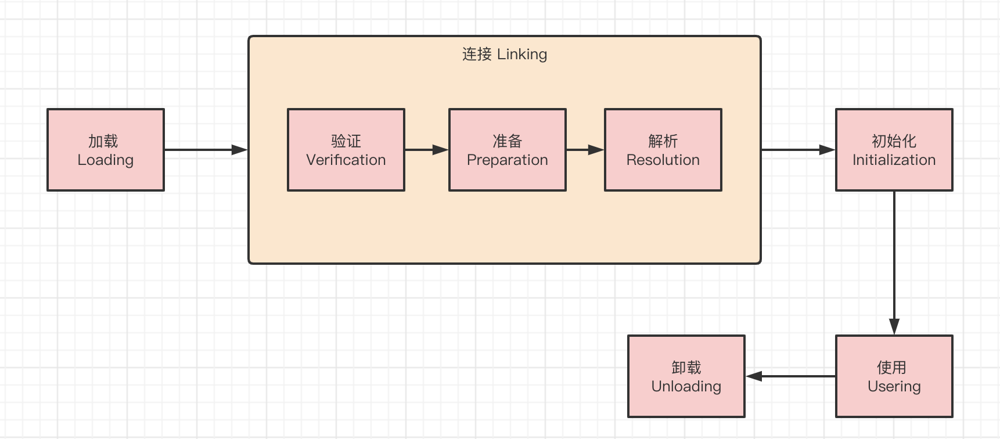

>  主题

面试官：Java文件是如何被加载到内存中的？

面试官：如何构造一个自定义类加载器？

面试官：什么是双亲委派机制？

**Class 文件需要加载到虚拟机中之后才能运行和使用，那么虚拟机是如何加载这些 Class 文件呢？**

> 大纲

类加载过程

双亲委派机制

Java类加载器的分类

自定义类加载器

> 参考内容

[十分钟搞懂Java类加载](https://mp.weixin.qq.com/s?__biz=MzIxNzM0NjA1OQ==&mid=2247483698&idx=1&sn=6ab24416042310b91f9363fff3402370&chksm=97fa7856a08df140e0a97ad31cbfcc3b99d13741e1db365ea08ab307392f3d1b1535f2041fdb&token=471240037&lang=zh_CN#rd)

[Java 类加载机制](https://pdai.tech/md/java/jvm/java-jvm-classload.html)

[类加载过程详解](https://javaguide.cn/java/jvm/class-loading-process.html)

[JVM：类加载过程](https://cloud.tencent.com/developer/article/1787638)

[jvm类加载器，类加载机制详解，看这一篇就够了](https://segmentfault.com/a/1190000037574626)

[阿里P7面试官：请你简单说一下类加载机制的实现原理？ ](https://www.cnblogs.com/mic112/p/15490566.html)

> 正文

## 类加载过程

系统加载 Class 类型的文件主要三步：**加载->连接->初始化**。

连接过程又可分为三步：**验证->准备->解析**

## 加载

> 加载是类加载过程的第一个阶段，在加载阶段，虚拟机需要完成以下三件事情

- 通过一个类的全限定名来获取其定义的**二进制字节流**。
- 将这个字节流所代表的静态存储结构转化为**方法区的运行时数据结构**。
- 在**Java堆**中生成一个代表这个**类的java.lang.Class对象**，作为对方法区中这些数据的访问入口。

> 加载.class文件的方式

- 从**本地文件**系统中直接加载
- 通过**网络下载**.class文件
- 从**zip，jar等归档文件**中加载.class文件
- 从专有**数据库**中提取.class文件
- 将**Java源文件**动态编译为.class文件

## 链接

### 验证

### 准备

### 解析

## 初始化

类加载器分类

双亲委派机制

自定义类加载器

